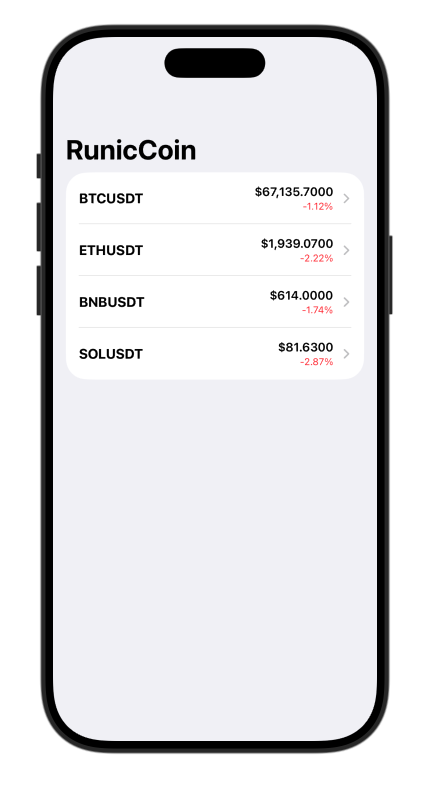
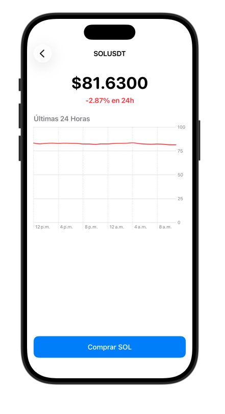
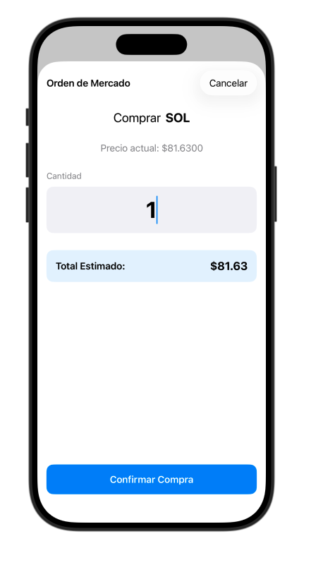
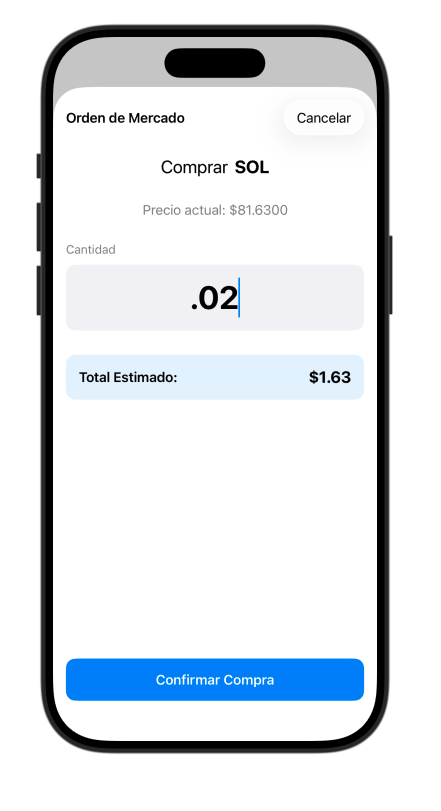

# 🚀 RunicCoin Tracker

> **Nota Personal**: Esta aplicación forma parte de mi portafolio y mi viaje de aprendizaje para convertirme en **iOS Developer**. El objetivo principal de este proyecto no es solo construir una app funcional de criptomonedas, sino aplicar y dominar conceptos modernos de desarrollo en el ecosistema de Apple.

---

## 📱 Vistazo a la App

Aquí puedes ver el flujo principal de la aplicación: desde la lista de activos en tiempo real, hasta la visualización de datos históricos (K-Lines) usando librerías nativas, y finalmente, un flujo simulado de compra.

| Dashboard Principal | Vista de Detalle (Swift Charts) | Ingreso de Orden | Confirmación de Compra |
| :---: | :---: | :---: | :---: |
|  |  |  |  |

---

## 🛠️ Enfoque de Aprendizaje y Tecnologías

El desarrollo de RunicCoin me ha permitido consolidar conocimientos clave buscados en la industria de desarrollo iOS en 2026:

### 1. Arquitectura Robusta (MVVM)
Separación estricta de responsabilidades. La lógica de negocio y las llamadas a la red no "ensucian" las vistas.
- **Modelos**: Estructuras limpias y conformantes a `Codable`, `Identifiable` y `Hashable`.
- **ViewModels**: Uso intensivo de `@Published` y `@StateObject` (vía `Combine` / `ObservableObject`) para asegurar que la UI reaccione a los cambios de estado (Carga, Error, Éxito) automáticamente.

### 2. UI Declarativa (SwiftUI)
Todo el rediseño de la interfaz se construyó utilizando componentes nativos de SwiftUI:
- Navegación moderna usando **`NavigationStack`** y **`NavigationLink(value:)`** adaptándome a las mejores prácticas post-iOS 16.
- Listas dinámicas, celdas componibles (`HStack/VStack`), y modificadores como `.refreshable` para lograr una experiencia "pull-to-refresh" idéntica a las apps del sistema.

### 3. Concurrencia Moderna (Async / Await)
Dejamos atrás los "completion handlers" para integrar un servicio de red completamente escrito con `async throws`.
- Consumo de **Bybit API V5** utilizando peticiones asíncronas limpias que no bloquean el hilo principal (`@MainActor` en los ViewModels).

### 4. Gráficos Nativos (Swift Charts)
En lugar de depender de librerías de terceros (Pods/SPM), invertí tiempo en estudiar e implementar **`Swift Charts`** (el framework de Apple introducido en iOS 16).
- Mapeado histórico de datos devueltos por la API de Bybit (K-Lines: Velas de precios).
- Uso de `LineMark` e interpolación (`.monotone`) para crear una gráfica de tendencias limpia de las últimas 24 horas.

---

## 📈 Características Implementadas

✅ **Lista de Mercado Spot**: Monitoreo en vivo de BTC, ETH, SOL, y BNB consumiendo la API de Bybit.  
✅ **Pull to Refresh**: Actualiza los precios arrastrando la lista hacia abajo.  
✅ **Gestión de Navegación Segura**: Paso de datos entre listas y vistas de detalle de forma eficiente.  
✅ **Historial de Precios**: Gráfica de los precios de cierre (las últimas 24 horas) en la vista de detalle.    
✅ **Simulación de Orden de Mercado (Modal)**: Interfaz de compra (`.sheet`) con cálculos reactivos automáticos e integrados con el teclado del sistema (`.decimalPad`).  

---

## 👨‍💻 Cómo ejecutarlo

1. Clona este repositorio:
   ```bash
   git clone https://github.com/TU_USUARIO/RunicCoin.git
   ```
2. Abre la carpeta del proyecto en **Xcode 16** (o superior).
3. Asegúrate de tener seleccionado un simulador con **iOS 17+**.
4. ¡Presiona `Cmd + R` para construir y correr! No necesita dependencias externas (SPM o CocoaPods), todo es `Foundation` y `SwiftUI` puro.

---

_Desarrollado con ❤️ en Swift durante mi transición como desarrollador iOS._
